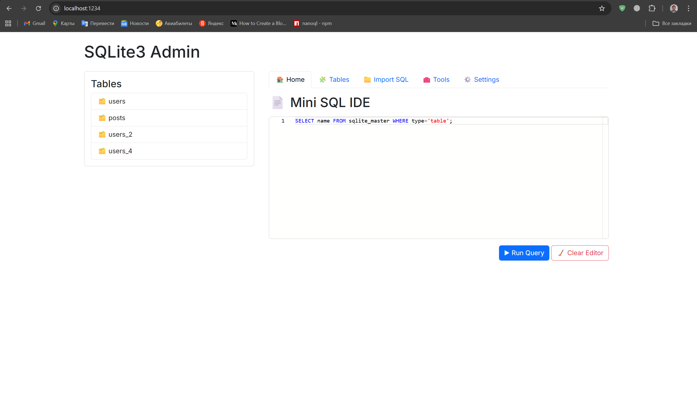

# SQLite3 Admin

A lightweight, beautiful, zero-config web based SQLite admin panel.
#### [Online demo](https://sqlite3-admin.onrender.com/)
### In 1 second:
```bash
npx sqlite3-admin mydb.sqlite
```

—or install globally—
```bash
npm i -g sqlite3-admin
sqlite3-admin mydb.sqlite
```

This will open your default browser with a modern admin UI.

### Features
 - 🔍 Browse tables
 - ➕ Insert rows
 - 📝 Edit rows
 - ❌ Delete rows
 - 📥 Import .sql files
 - ⚙️ Settings page (dark mode, rows per page etc.)
 - 🧰 Tools page (quick utilities)
 - Autodetect primary key and autoincrement
 - No setup. No config. Just run.

### Usage
Start admin panel
```bash
npx sqlite3-admin ./database.db
```
Default port

`http://localhost:1234`
Automatically opens browser.

### Import SQL

Go to the “Import SQL” tab → upload `.sql` file

The file will be executed directly on the database.

### Settings page

 - Dark mode
 - Rows per page (pagination)
 - UI preferences

Settings are stored in small JSON file (persistent).

### Why this exists?

Because sqlite browsers are either:
 - not cross-platform
 - look old
 - too heavy (Electron apps)
This one is:
 - Node.js based
 - front-end modern
 - runs anywhere

### Development
```bash
git clone https://github.com/USERNAME/sqlite3-admin
cd sqlite3-admin
npm install
npm start test.db
```

License

MIT

Powered by Jahongir Sobirov
